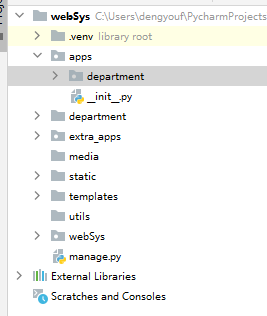

# 员工管理系统

## 一、项目创建

### 1.1 创建项目和相关目录

```shell
pip install django==3.2 -i https://mirrors.aliyun.com/pypi/simple/
django-admin startproject webSys .
mkdir static 
mkdir templates
mkdir apps
mkdir extra_apps
mkdir media
mkdir utils
```


| 目录       | 说明               | 配置方式                                                     |
| ---------- | ------------------ | ------------------------------------------------------------ |
| webSys     | 项目目录           |                                                              |
| static     | 静态文件目录       | `STATIC_URL = '/static/'`<br />`STATICFILES_DIRS = [ os.path.join(BASE_DIR, "static"), ]` |
| templates  | 模板文件目录       | `'DIRS': ['templates']`                                      |
| apps       | 应用统一管理目录   | `sys.path.insert(0, os.path.join(BASE_DIR, 'apps'))`         |
| extra_apps | 第三方应用管理目录 | `sys.path.insert(0, os.path.join(BASE_DIR, 'extra_apps')`    |
| media      | 多媒体文件目录     | `MEDIA_URL = "/media/"`<br/>`MEDIA_ROOT = os.path.join(BASE_DIR, "media")` |
| utils      | 工具包目录         |                                                              |

### 1.2  配置 settings.py

```python
import os

BASE_DIR = os.path.dirname(os.path.dirname(os.path.abspath(__file__)))

import sys
sys.path.insert(0, os.path.join(BASE_DIR, 'apps'))
sys.path.insert(0, os.path.join(BASE_DIR, 'extra_apps'))

SECRET_KEY = '#f6kc=b1cjfl0u5*d(^&=_g&3c3ago%dfo6_in32eno(uvbgal'

DEBUG = True

ALLOWED_HOSTS = []


# Application definition

INSTALLED_APPS = [
    'django.contrib.admin',
    'django.contrib.auth',
    'django.contrib.contenttypes',
    'django.contrib.sessions',
    'django.contrib.messages',
    'django.contrib.staticfiles',
]

MIDDLEWARE = [
    'django.middleware.security.SecurityMiddleware',
    'django.contrib.sessions.middleware.SessionMiddleware',
    'django.middleware.common.CommonMiddleware',
    'django.middleware.csrf.CsrfViewMiddleware',
    'django.contrib.auth.middleware.AuthenticationMiddleware',
    'django.contrib.messages.middleware.MessageMiddleware',
    'django.middleware.clickjacking.XFrameOptionsMiddleware',
]

ROOT_URLCONF = 'webSys.urls'

TEMPLATES = [
    {
        'BACKEND': 'django.template.backends.django.DjangoTemplates',
        'DIRS': ['templates'],
        'APP_DIRS': True,
        'OPTIONS': {
            'context_processors': [
                'django.template.context_processors.debug',
                'django.template.context_processors.request',
                'django.contrib.auth.context_processors.auth',
                'django.contrib.messages.context_processors.messages',
            ],
        },
    },
]

WSGI_APPLICATION = 'webSys.wsgi.application'


# Database
# https://docs.djangoproject.com/en/2.2/ref/settings/#databases
DATABASES = {
    'default': {
        'ENGINE': 'django.db.backends.mysql',
        'NAME': 'websys',
        'USER': 'root',
        'PASSWORD': 'rootPwd',
        'HOST': '127.0.0.1',
        'PORT': '3306',
    }
}


# Password validation
# https://docs.djangoproject.com/en/2.2/ref/settings/#auth-password-validators

AUTH_PASSWORD_VALIDATORS = [
    {
        'NAME': 'django.contrib.auth.password_validation.UserAttributeSimilarityValidator',
    },
    {
        'NAME': 'django.contrib.auth.password_validation.MinimumLengthValidator',
    },
    {
        'NAME': 'django.contrib.auth.password_validation.CommonPasswordValidator',
    },
    {
        'NAME': 'django.contrib.auth.password_validation.NumericPasswordValidator',
    },
]


# Internationalization
# https://docs.djangoproject.com/en/2.2/topics/i18n/

LANGUAGE_CODE = 'zh-Hans'

TIME_ZONE = 'Asia/Shanghai'

USE_I18N = True

USE_L10N = True

USE_TZ = False


# Static files (CSS, JavaScript, Images)
# https://docs.djangoproject.com/en/2.2/howto/static-files/

STATIC_URL = '/static/'
STATICFILES_DIRS = [ os.path.join(BASE_DIR, "static"), ]

MEDIA_URL = "/media/"
MEDIA_ROOT = os.path.join(BASE_DIR, "media")
```

### 1.3 配置pymysql

```
pip install pymysql

vim webSys/__init__.py
import pymysql

pymysql.install_as_MySQLdb()
```

### 1.4 创建应用

```shell
python manage.py startapp apis
mv apis ./apps
```



### 1.5 注册 app

```python
编辑 settings.py 文件，添加 内容如下:
INSTALLED_APPS = [
	...
    'apis',
]
```

### 1.6 迁移数据库

```shell
python manage.py makemigrations
python manage.py migrate

mysql> use websys
Reading table information for completion of table and column names
You can turn off this feature to get a quicker startup with -A

Database changed
mysql> show tables;
+----------------------------+
| Tables_in_websys           |
+----------------------------+
| auth_group                 |
| auth_group_permissions     |
| auth_permission            |
| auth_user                  |
| auth_user_groups           |
| auth_user_user_permissions |
| django_admin_log           |
| django_content_type        |
| django_migrations          |
| django_session             |
+----------------------------+
```

### 1.7 启动服务

```shell
python manage.py runserver
```


## 二、数据库模型创建

### 2.1 定义数据库模型

编辑 apis/models.py 文件，定义数据库模型，这里定义两个表，部门表跟员工表，部门表与员工表是一对多关系。

```python
from django.db import models

# Create your models here.
class Base(models.Model):
    """ 基表 不会实际创建表"""
    class Meta:
        abstract = True
    created_at = models.DateTimeField(auto_now_add=True)
    updated_at = models.DateTimeField(auto_now=True)

class Department(Base):
    """ 部门表 """
    class Meta:
        db_table = "t_department"
        verbose_name = "部门"
        verbose_name_plural = verbose_name
    
    name = models.CharField(max_length=32, unique=True, verbose_name="部门名称")
    
    def __str__(self):
        return f"<{self.name}>"

class Employee(Base):
    """ 员工表 """
    class Meta:
        db_table = "t_employee"
        verbose_name = "员工"
        verbose_name_plural = verbose_name
    name = models.CharField(max_length=32, verbose_name="姓名")
    password = models.CharField(max_length=32, verbose_name="密码")
    age = models.IntegerField(default=1, verbose_name="年龄")
    sex_choices = ((0, "女"), (1, "男"))
    gender = models.SmallIntegerField(choices=sex_choices, default=0, verbose_name="性别")
    salary = models.DecimalField(max_digits=10, decimal_places=2, default=0, verbose_name="薪资")

    department = models.ForeignKey(to="Department", to_field="id", related_name="employee", on_delete=models.CASCADE)

    def __str__(self):
        return f"<{self.name}:{self.gender}:{self.age}>"
```

### 2.2 迁移数据库

```shell
python manage.py makemigrations
python manage.py migrate
```

### 2.3 使用 django shell 创建部门和员工

```python
python manage.py shell

>>> d1 = Department(name="运维部")
>>> d1.save()
>>> d2 = Department(name="开发部")
>>> d2.save()


>>> e1 = Employee(name="小叶", age=18, gender=0, salary=5999, department=d1)
>>> e1.save()
>>> e2 = Employee(name="小蓝", age=28, gender=1, salary=9999, department=d1)
>>> e2.save()

>>> e3 = Employee(name="小宁", age=28, gender=0, salary=9999, department=d2)
>>> e3.save()

# 正向查询，由员工查部门 多 -> 1
>>> e = Employee.objects.get(id=1)
>>> e.department
<Department: <运维部>>
>>> e.department.name
'运维部'

# 反向查询， 由部门查员工
>>> d = Department.objects.get(name="运维部")
>>> d.employee.all()
<QuerySet [<Employee: <小叶:0:18>>, <Employee: <小蓝:1:28>>]>
```


## 三、配置首页

### 3.1  配置路由

在主路由文件引入子路由，在 apis 目录下创建 urls.py 文件配置路由。

```python
# 主路由配置 webSys.urls.py
from django.contrib import admin
from django.urls import path,include

urlpatterns = [
    path('admin/', admin.site.urls),
    path('', include("apis.urls"))
]

# 子路由配置 apis.urls.py
from django.urls import path
from . import  views 

urlpatterns = [
    path('', views.index, name="index")
]
```

### 3.2 配置视图函数

```python
from django.http import HttpRequest

def index(request:HttpRequest):
    return render(request, "index.html")
```

### 3.3 编写模板

模板使用bootstrap 创建

- 定义 base.html

```html
<!DOCTYPE html>
<html lang="en">
<head>
    <meta charset="UTF-8">
    <title>base</title>
    
    <link rel="stylesheet" href="">
    <link rel="stylesheet" href="">
    <!-- JS 加载有顺序，请注意-->
    <script src=""></script>
    <script src=""></script>
</head>
<body>
<!-- 导航栏-->
<nav class="navbar navbar-inverse" style="border-radius: 0">
  <div class="container">
    <div class="navbar-header">
      <button type="button" class="navbar-toggle collapsed" data-toggle="collapse" data-target="#bs-example-navbar-collapse-1" aria-expanded="false">
        <span class="sr-only">Toggle navigation</span>
        <span class="icon-bar"></span>
        <span class="icon-bar"></span>
        <span class="icon-bar"></span>
      </button>
      <a class="navbar-brand" href="/" style="color: greenyellow;font-weight: 700">管理系统</a>
    </div>

    <!-- Collect the nav links, forms, and other content for toggling -->
    <div class="collapse navbar-collapse" id="bs-example-navbar-collapse-1">
      <ul class="nav navbar-nav">
<!--        <li class="active"><a href="#">Lisssnk <span class="sr-only">(current)</span></a></li>-->
        <li class=""><a href="/department/list/">部门管理</a></li>
      </ul>
      <ul class="nav navbar-nav navbar-right">
        <li><a href="#">登陆</a></li>
        <li class="dropdown">
          <a href="#" class="dropdown-toggle" data-toggle="dropdown" role="button" aria-haspopup="true" aria-expanded="false">小叶<span class="caret"></span></a>
          <ul class="dropdown-menu">
            <li><a href="#">个人资料</a></li>
            <li><a href="#">我的信息</a></li>
            <li><a href="#">注销</a></li>
          </ul>
        </li>
      </ul>
    </div>
  </div>
</nav>
<!-- //导航栏-->
 
</body>
</html>
```

| 块名                              | 说明                      |
| --------------------------------- | ------------------------- |
| ` `  | 定义标题                  |
| `` | 定义菜单的选中状态 active |
| ` ` | 定义主页                  |

- 编写 index.html

```html


首页
  


欢迎登陆~

```


## 四、部门管理

### 4.1 部门列表


#### 4.1.1 配置路由

```python
urlpatterns = [
    path('', views.index, name="index"),

    path("department/list/", views.department_list, name="department_list"),
    path("department/add/", views.department_add, name="department_add"),
]
```

#### 4.1.2 配置视图

```python
from apis.models import  Department

def department_list(request):
    departments = Department.objects.all()
    
    return  render(request, 'department_list.html', {"departments": departments})
```

#### 4.1.3 配置模板

```html

部门管理

active


<div class="container">
<div class="bs-example" data-example-id="panel-without-body-with-table">
    <div class="panel panel-default">
      <!-- Default panel contents -->
      <div class="panel-heading"><i class=" glyphicon glyphicon-th-list" style="margin-right: 6px"></i><a class="btn btn-primary" href="/department/add/">新增部门</a></div>

      <!-- Table -->
      <table class="table">
        <thead>
          <tr>
            <th>#</th>
            <th>部门名称</th>
            <th>创建时间</th>
            <th>操作</th>
          </tr>
        </thead>
        <tbody>
        
          <tr>
            <th scope="row">{{department.id}}</th>
            <td>{{department.name}}</td>
            <td>{{department.created_at}}</td>
            <td>
                <a class="btn btn-info btn-sm" href="/department/edit/{{ department.id }}/" >编辑</a>
                <a class="btn btn-danger btn-sm" href="/department/del/{{ department.id }}/">删除</a>
            </td>
          </tr>
        
        </tbody>
      </table>
    </div>
  </div>
</div>

```

### 4.2 部门添加


#### 4.2.1 配置路由

```python
from django.urls import path
from . import  views
urlpatterns = [
	...
    path("department/add/", views.DepartmentView.as_view(), name="department_add"),
]
```

#### 4.2.2 配置视图

```python
from django.views import  View

class DepartmentView(View):
    def get(self, request):
        return render(request, "department_add.html")

    def post(self, request):
        name = request.POST.get("department_name")
        d = Department.objects.filter(name=name)
        if d:
            return render(request, "department_add.html" ,{"msg": f"{name}已存在"})
        Department.objects.create(name=name)

        return redirect("/department/list/")
```

#### 4.2.3 配置模板

```HTM

部门管理

active


<div class="container">
  <div class="panel panel-default">
    <div class="panel-heading">
      <h3 class="panel-title"> 添加部门</h3>
    </div>
    <div class="panel-body">
      <div class="col-lg-1"></div>
      <div class="col-lg-9">
        <form class="form-horizontal" method="post" action="/department/add/" return="false">
          
          <div class="form-group">
            <label  class="col-sm-2 control-label">部门名称</label>
            <div class="col-sm-10">
              <input type="text" class="form-control" name="department_name" placeholder="请输入部门名称">
            </div>
          </div>
          <div class="form-group">

            <div class="col-sm-10">
              <label  class="col-sm-2 control-label"></label>
              <span style="color: red; font-size: 18px">{{ msg }}</span>
            </div>
          </div>
          <div class="form-group">
            <div class="col-sm-offset-2 col-sm-10">
              <button type="submit" class="btn btn-primary">添加</button>
            </div>
          </div>
        </form>
      </div>
      <div class="col-lg-2"></div>
    </div>
  </div>
</div>

```

### 4.3 部门编辑

#### 4.3.1 配置路由

```python
from django.urls import path
from . import  views
urlpatterns = [
    ...
    path("department/edit/<int:id>/", views.DepartmentDetailView.as_view(), name="department_edit"),
]
```

#### 4.3.2 配置视图

```python
class DepartmentDetailView(View):
    def get(self, request, id):
        department = Department.objects.get(id=id)
        if department:
            id = department.id
            print(type(id))
            name = department.name
            return  render(request, "department_edit.html", {"id": id, "name": name})

    def post(self, request, id):
        department = Department.objects.get(id=id)
        name = request.POST.get("department_name",department.name )
        if name:
            department.name = name
            department.save()
            return redirect("/department/list/")
        else:
            return render(request, "department_edit.html", {"id": id, "name": name, "msg": "项目名不能为空"})
```

#### 4.3.3 配置模板

```html

部门管理

active


<div class="container">
  <div class="panel panel-default">
    <div class="panel-heading">
      <h3 class="panel-title">编辑部门</h3>
    </div>
    <div class="panel-body">
      <div class="col-lg-1"></div>
      <div class="col-lg-9">
        <form class="form-horizontal" method="post" action="/department/edit/{{id}}/" return="false">
          
          <div class="form-group">
            <label  class="col-sm-2 control-label">部门名称</label>
            <div class="col-sm-10">
              <input type="text" class="form-control" name="department_name" placeholder="{{ name }}">
            </div>
          </div>
          <div class="form-group">

            <div class="col-sm-10">
              <label  class="col-sm-2 control-label"></label>
              <span style="color: red; font-size: 18px">{{ msg }}</span>
            </div>
          </div>
          <div class="form-group">
            <div class="col-sm-offset-2 col-sm-10">
              <button type="submit" class="btn btn-primary">更改</button>
            </div>
          </div>
        </form>
      </div>
      <div class="col-lg-2"></div>
    </div>
  </div>
</div>

```

### 4.4 部门删除

#### 4.4.1 配置路由

```python
from . import  views
urlpatterns = [
	...
    path("department/del/<int:id>/", views.DepartmentDelete, name="department_del"),
]
```

#### 4.4.1 配置视图

```PY
def DepartmentDelete(request, id):
    department = Department.objects.get(id=id)
    department.delete()
    return  redirect("/department/list/")
```

#### 4.4.1 配置模板

删除无需模板


